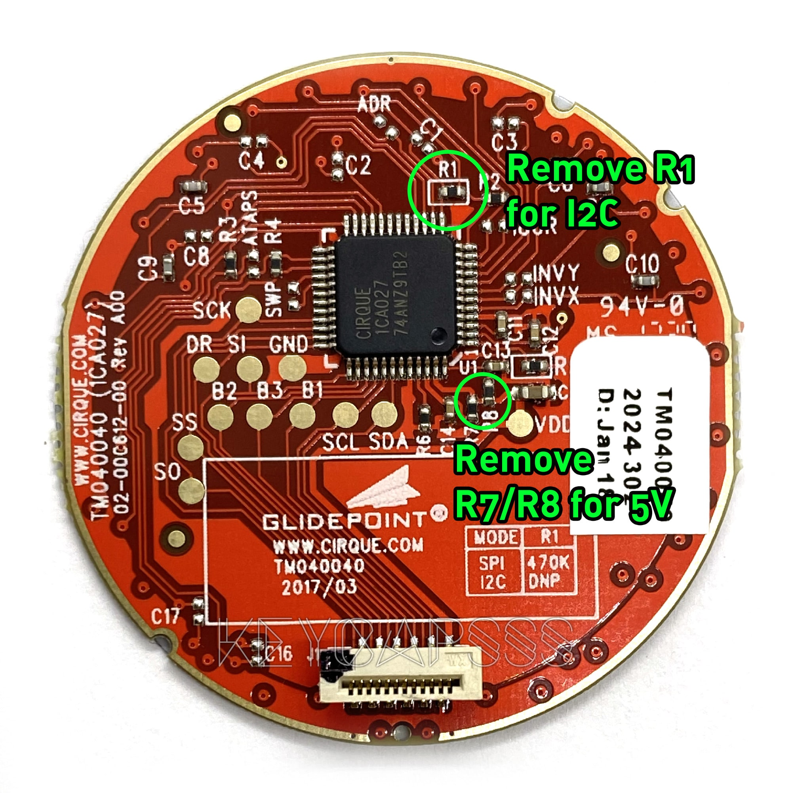
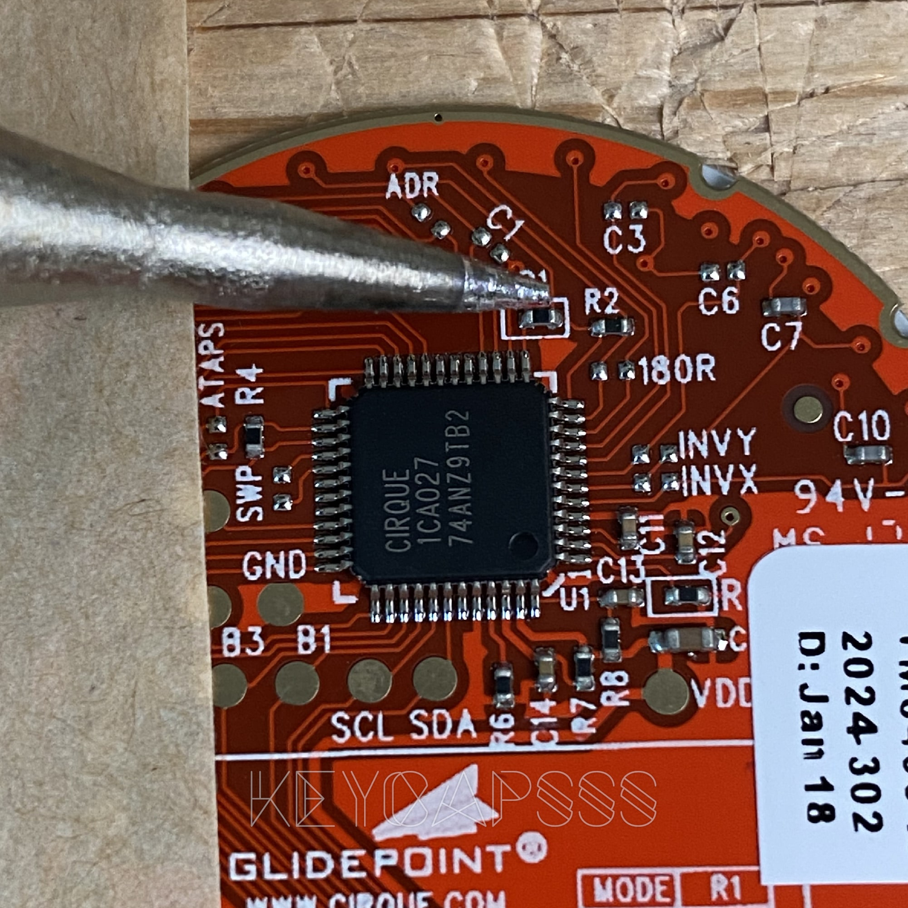
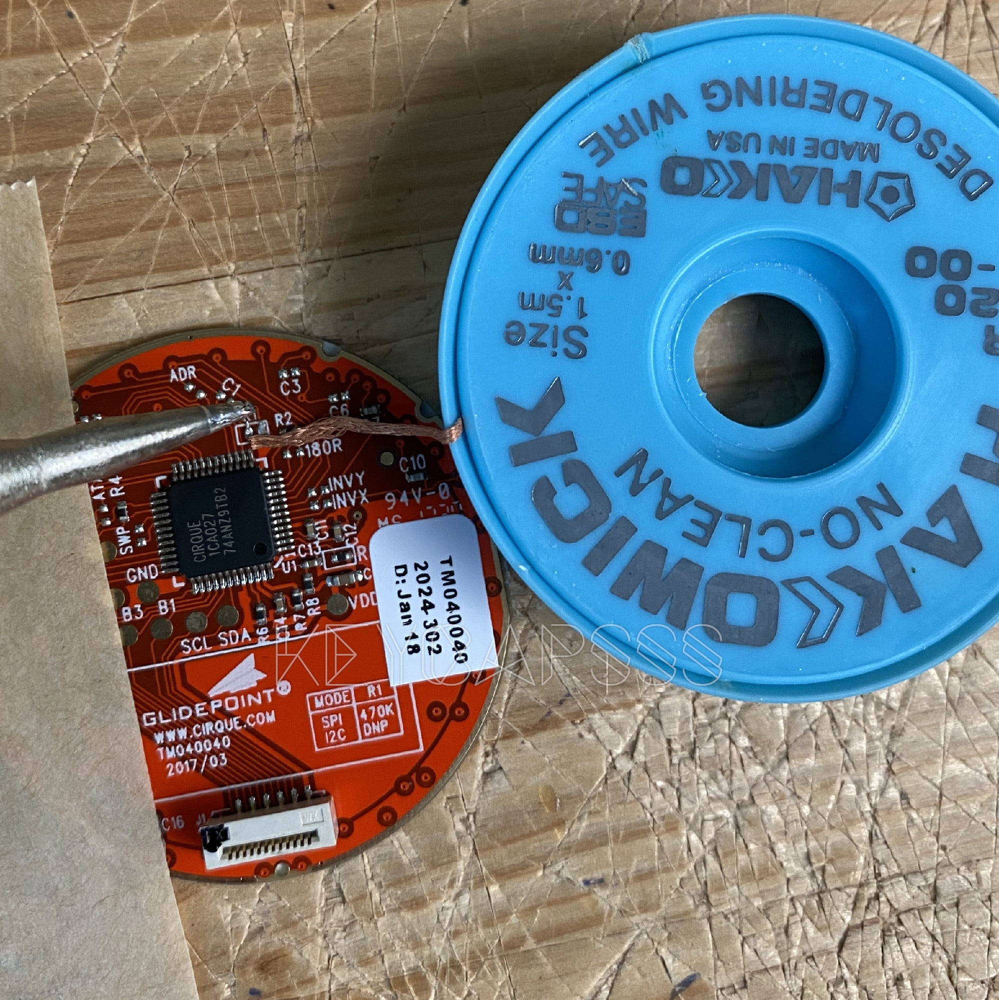
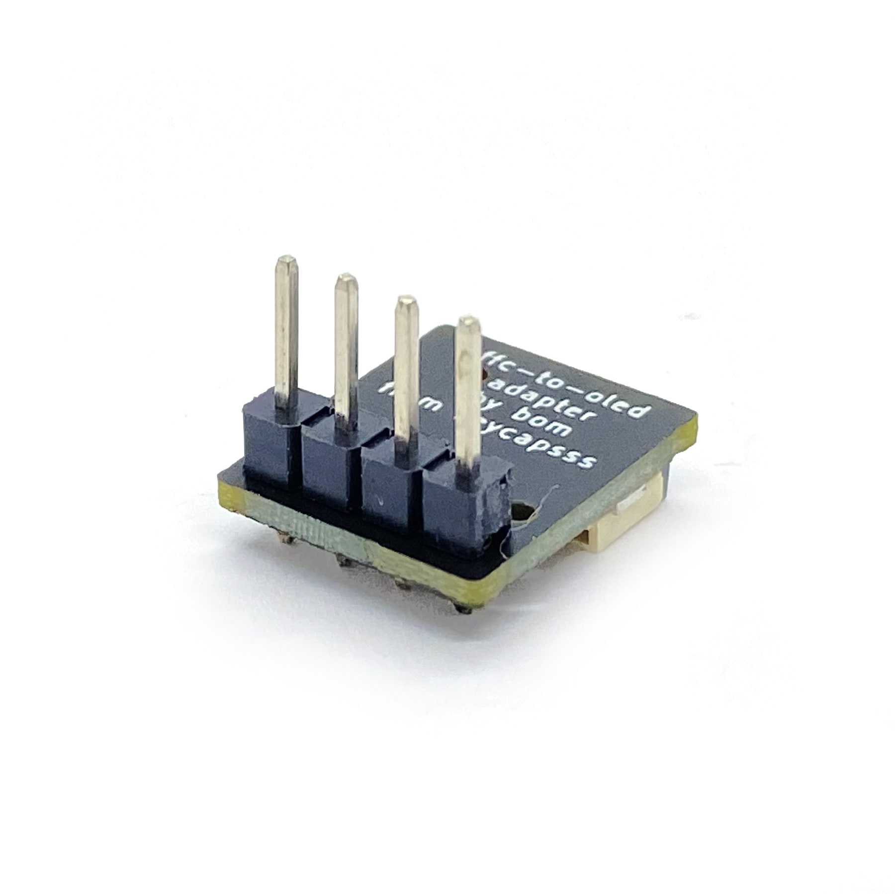
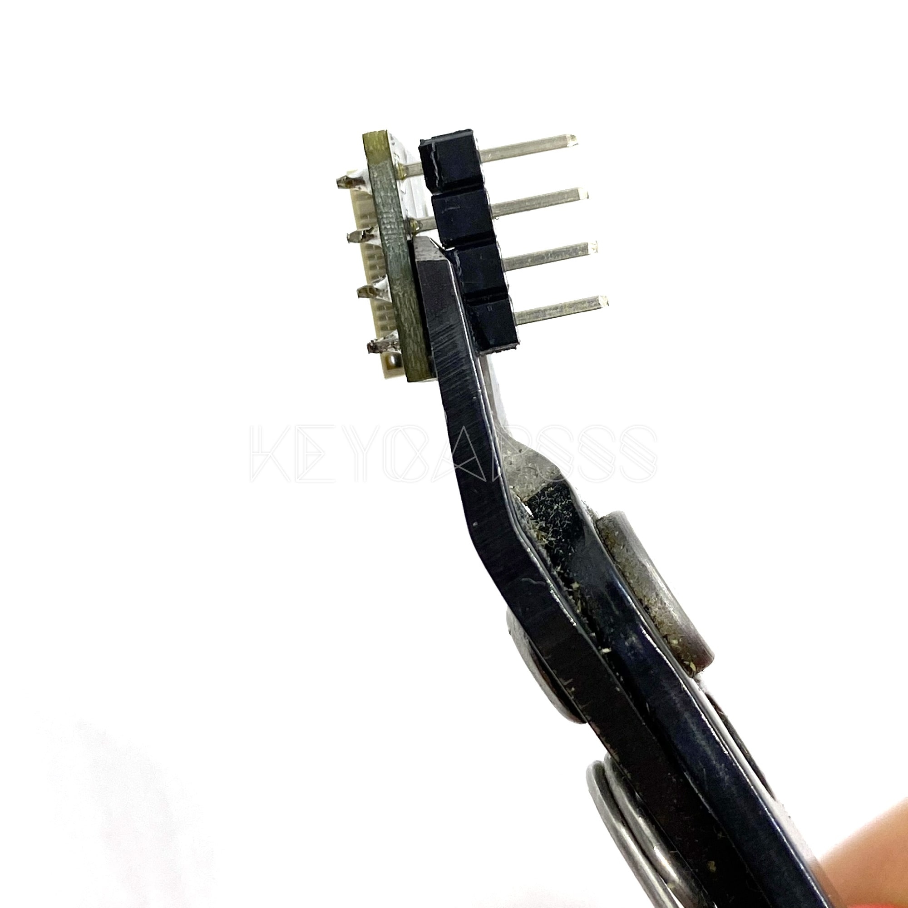
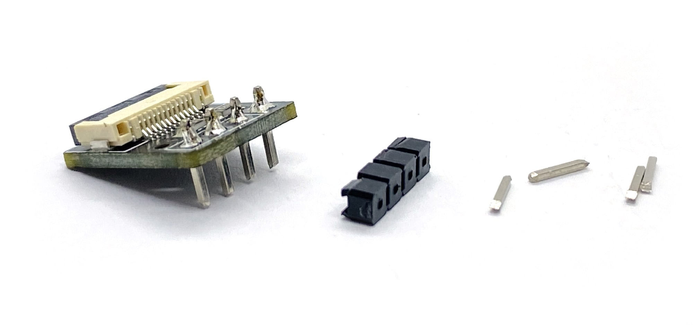
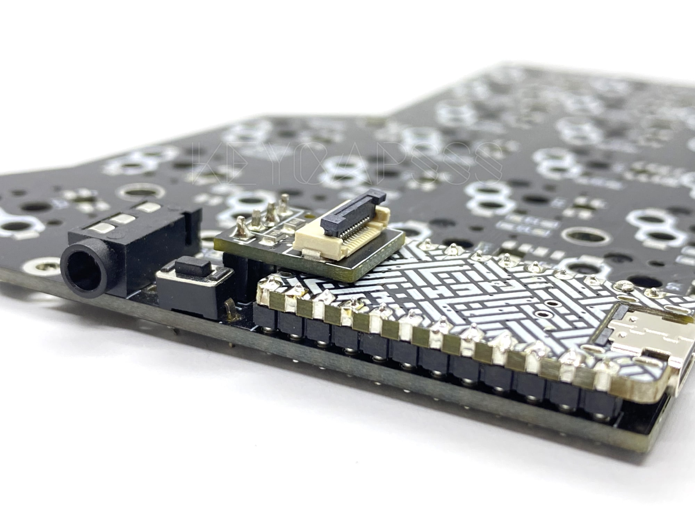
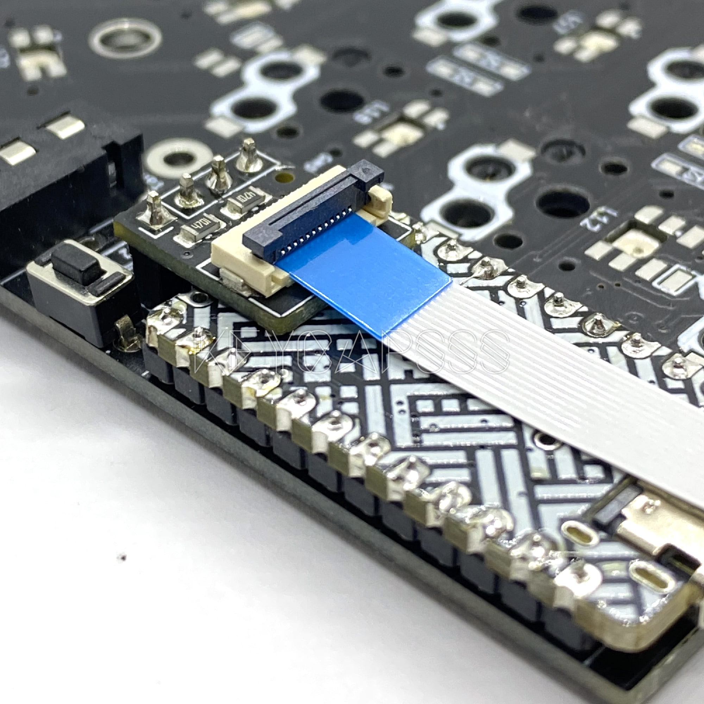
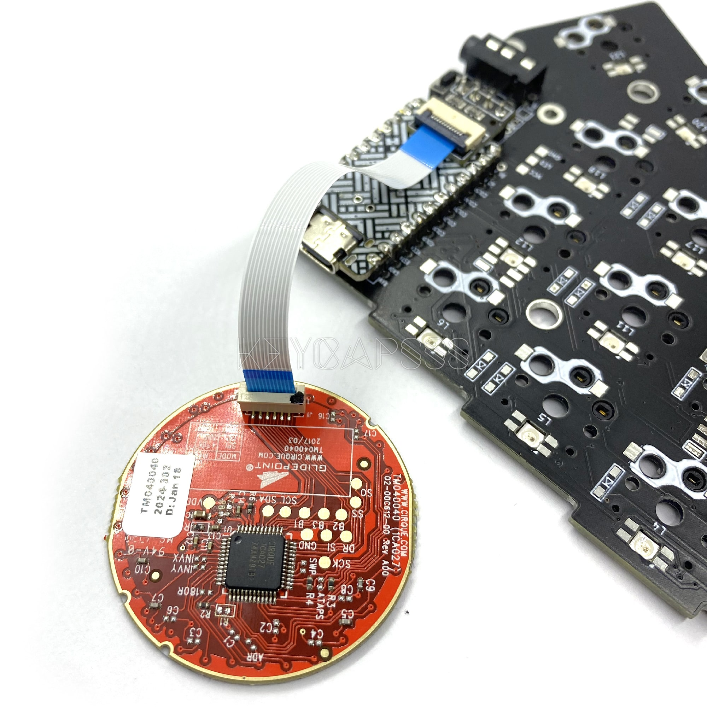

# GlidePoint Cirque Trackpad with Adapter PCB

## Adapter PCB

The Adapter PCB can be used on any keyboard with a I2C oled display connector like the CRKBD, Lily58, or Kimiko.

The Adapter PCB has two 4.7k pull up resistor for I2C, to make it split keyboard compatible with serial communication.

## SPI or I2C

The Cirque trackpad if configured by default for SPI.
To use it with the I2C Adapter PCB, you have to remove a resistor (__R1__).

## 3V or 5V

You can power the Cirque trackpad by default with 2.5-3.6V and use it for example with a SparkFun Pro Micro RP2040.
To use a 5V controller, you have to remove two resistors (__R7, R8__).



## How to remove the resistors

You can use a hot air gun to remove the resistors.
Be careful to not melt the FFC connector.

To use a solder iron to remove the resistor, put some solder on the tip. Touch the resistor sideways with the solder iron tip and push it carefully aside.



Clean the solder points with some desoldering wire, to remove the remaining solder.



## Assembly

Solder the 4pin header to the Adapter PCB.



If you use low profile sockets for you controller like the Mill-Max Series 315, remove the black plastic and shorten the legs with your pliers.
This way you can mount the Adapter PCB low as possible.

Lift the plastic carefully with the pliers.



Shorten the pins with the pliers.



Place the Adapter PCB on the oled socket (I2C).



Lift the black part of the FFC cable connector and insert the cable with blue part facing up.

> The FFC/FPC cable is a 12 position with 0.5mm pitch.



Then insert the cable into the trackpad.
The blue part on the cable must be facing to the black dot on the cable connector.



## QMK firmware support

Add the following lines to your `rules.mk`. For example `qmk_firmware/keyboards/crkbd/keymaps/default/rules.mk`

```c
POINTING_DEVICE_ENABLE = yes
POINTING_DEVICE_DRIVER = cirque_pinnacle_i2c
```

To rotate or invert the trackpad this to your `config.h`:

```c
#define POINTING_DEVICE_ROTATION_90
#define POINTING_DEVICE_INVERT_X
#define POINTING_DEVICE_INVERT_Y
```

Check the [QMK docs](https://docs.qmk.fm/#/feature_pointing_device?id=cirque-trackpad) for more settings.

Compile the firmware `qmk compile -kb crkbd -km default` and flash the hex file with [QMK Toolbox](https://github.com/qmk/qmk_toolbox).

## Credits

The Adapter PCB is made by [@bom_tarnes](https://twitter.com/bom_tarnes) and is [open source](https://github.com/keyboard-magpie/minimal-fpc-i2c-pcb).

Inspired by beekeeb and his [build guide](https://beekeeb.com/cirque-trackpad-i2c-on-corne-keyboard/).
